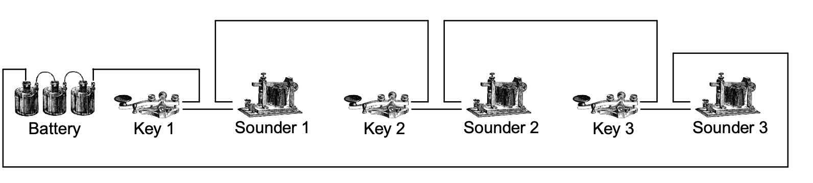

# Extending the CWCom Communications Protocol to Support Closed-Circuit Telegraphy
Les Kerr; 25 June 2006; Revised, 13 June 2008

The CWCom system, developed by John Samin at MRX Software, is a popular and successful method of sending Morse code over the internet. CWCom does an excellent job of simulating radiotelegraphy.

Unlike radiotelegraphy, landline telegraphy typically works as a closed circuit system, with all the keys and sounders connected in series as shown in Figure 1. The keys are normally closed, which allows the battery to send a current through the circuit and energize the sounders.

When an operator wants to transmit, he opens his key, thereby breaking the circuit. As he taps out his message, each press of the key is heard as a click-clack on all the sounders in the circuit as they are energized and deenergized. At the end of his transmission, the operator closes his key. This completes the circuit, allowing another operator to send.

# CWCom protocol
CWCom uses a simple but very effective method of transmitting Morse code over the internet. The timing of the elements of each character is encoded as a sequence of numbers and sent in its own packet over the network. A positive number represents the length of a mark (key down, or closed circuit) in milliseconds, and a negative number represents a space (key up, or open circuit).

For example, the packet for a V would look something like 

    (–2000, +50, –50, +50, –50, +50, –50, +150)

where each +50 represents a dot 50 ms in length, the +150 is the 150 ms dash, each –50 stands for an interelement space, and the –2000 means the V starts 2 seconds after the end of the previous character.

As another example, here’s the word TEST sent on a bug at about 25 wpm. Notice how each letter is sent in a separate packet, for a total of four packets.

    (–347, +145)
    (–183, +51)
    (–160, +51, –47, +47, –51, +47) (–211, +144)

As you might expect, the actual CWCom protocol is a bit more complicated than this. For the purposes of the present discussion, however, that’s all there is to it.

# Closed-circuit extension
According to the CWCom protocol, the circuit is opened at the end of each packet. So what to do when an operator closes the key at the end of his transmission? The solution is to add two new rules to the protocol giving special significance to timing values of +1 and +2.
- +1: Signals the beginning of a long mark. Latch the circuit closed until the end of the following mark.
- +2: Signals the end of a long mark. Unlatch the circuit.

# MorseKOB operation – sending
Now let’s take a look at how the MorseKOB program takes advantage of this extension to the CWCom protocol to simulate closed-circuit telegraphy. First we’ll see how the program works from the sender’s point of view.

Whenever the operator closes his key – whether it’s the start of a dot or dash or the circuit closure at the end of a transmission – the KOB program starts a timer.1 If the timer elapses before the key is opened again, the program assumes the circuit has been closed indefinitely. It signals this fact by adding a +1 timing element to the end of the current packet buffer, and the packet is sent out over the internet.

Once the sending program is in this latched mode, when the key is eventually opened again the program sends the following packet

    (–n, +2)

where n is the overall length of the key-down period.2

# MorseKOB operation – receiving
Whenever the receiving program encounters a +1 code element, it closes its local circuit and leaves it closed until it receives a mark of length greater than 1 ms.

Normally, the KOB program buffers received code elements before sending them to the sounder, so everything you hear from the program is heard about half a second after it was actually sent. The purpose of this delay is to eliminate any jitter that might be caused by varying character lengths or network transmission delays.

This delay has an unfortunate side-effect, however. It increases the chances that two operators might start sending at the same time. To reduce the probability of this happening, upon receiving a (–n, +2) packet the program checks to see if n is greater than 3000. If it is, then the program assumes that it’s a break rather than a long dash, and it opens the local circuit immediately instead of buffering the packet as usual.

# Compatibility with CWCom
An early design goal for the KOB program was that it be compatible with the CWCom server as well as with CWCom client programs. In other words, CWCom users and KOB users should be able to share the same channel on a CWCom server and communicate with each other in Morse.

Generally speaking, the desired compatibility occurs quite naturally. When a KOB user closes his key at the end of his transmission, CWCom users may be aware of a very brief blip at the beginning and end of the key-down period if they’re copying by CW tone. If they’re copying on an external sounder, chances are they won’t hear a thing.

A more serious complication arises when a CWCom user ends his transmission. From the point of view of the KOB users, it appears that the sender has left the circuit open and their keys will be inactive. To get around this problem, a feature has been added to the KOB program, which allows a user to regain control of the circuit by toggling the Circuit Closer on the KOB window. This feature has the added benefit of providing a recovery mechanism when another KOB user accidentally leaves the circuit open.

# Break behavior
An operator on a closed-circuit telegraph wire can interrupt the transmission of a sending operator by opening his own key. This breaks the circuit, causing all the sounders on the wire – including the sending operator’s sounder – to go silent. When the sending operator’s sounder stops following his key, he knows he has been “broken”. He then closes his key, which allows the breaking operator to take control of the wire.

MorseKOB mimics this behavior very closely. If one KOB user opens his key while another user is sending, almost immediately the sending user’s sounder goes silent. The sending user responds by closing his key, at which point the breaking user’s sounder becomes active and starts following his key.

There are two ways in which MorseKOB does not emulate true break behavior. For one thing, the sending operator can override the break and regain control of the wire by toggling the Circuit Closer on the KOB window.

The other departure from reality is the effect of the break as observed by users other than the sending and breaking users. If the sender continues to send after the break in spite of the fact that his sounder has gone silent – perhaps because he’s sending from the keyboard and not paying close attention to the sounder – all users on the wire other than the sender and breaker will hear the continued sending; on a real telegraph wire the circuit would be open and they’d hear nothing. This effect is a result of the simplistic way the KOB program handles multiple users, rather than a shortcoming of the extended CWCom protocol itself.